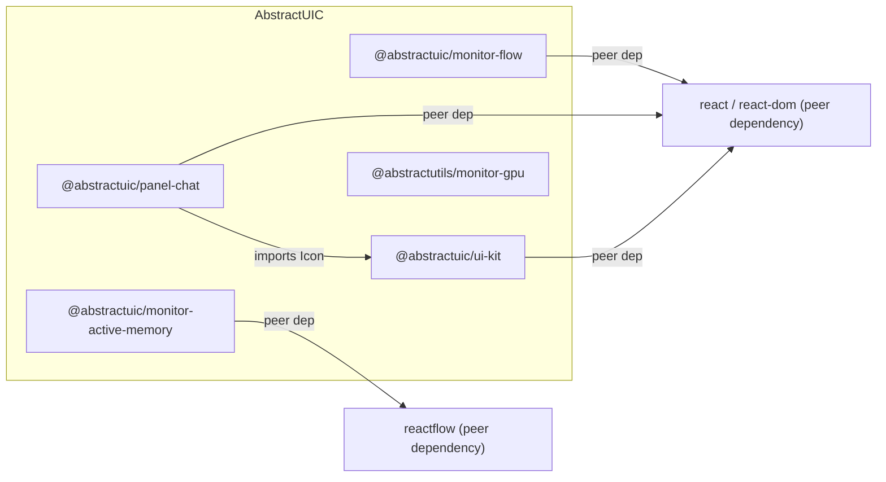
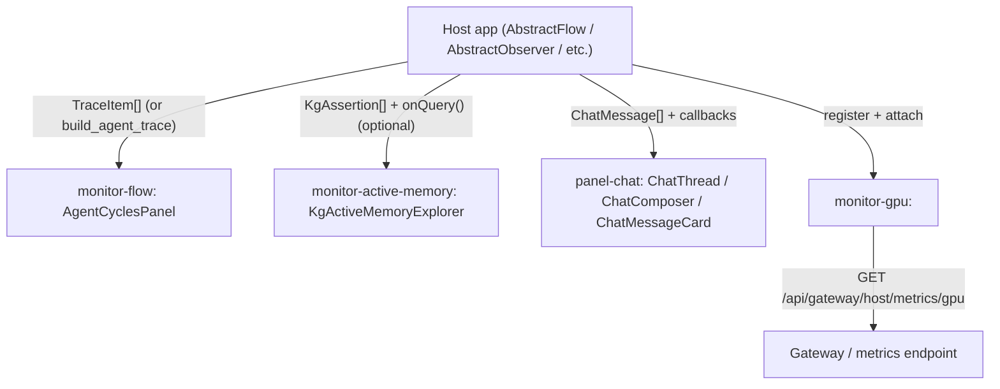

# Architecture

AbstractUIC is a **multi-package repository**: each folder at the repo root is an independently-consumable package.

This document stays intentionally close to the code: every claim below is backed by a package entrypoint, type definition, or runtime contract in `src/`.

## High-level overview

- **React packages** ship **TypeScript/TSX source** via `exports -> ./src/index.ts` (see each `package.json`).
- **`@abstractutils/monitor-gpu`** ships **JavaScript** (`exports -> ./src/index.js`) and registers a custom element.
- Styling is shipped as plain CSS and imported by components (for example `panel-chat/src/panel_chat.css`).

## Package dependency graph

Evidence:
- `panel-chat/src/chat_message_card.tsx` imports `Icon` from `@abstractuic/ui-kit`.
- `monitor-active-memory/package.json` declares `reactflow` as a peer dependency.

## Runtime data flow

AbstractUIC components are designed to be **host-driven**: hosts provide data and callbacks; the packages do not import host code.

Evidence:
- `monitor-flow/src/AgentCyclesPanel.tsx` consumes `TraceItem[]` and groups cycles by `step.effect.type === "llm_call"`.
- `monitor-flow/src/agent_cycles_adapter.ts` exports `build_agent_trace(...)` to adapt ledger-like records into `TraceItem[]`.
- `monitor-active-memory/src/KgActiveMemoryExplorer.tsx` consumes `items: KgAssertion[]` and optionally calls `onQuery(params)`.
- `monitor-gpu/src/gpu_metrics_api.js` builds/fetches the metrics URL and attaches Bearer auth headers.

## Contracts & types (what you pass in)

### Knowledge graph / active memory (`monitor-active-memory`)

- `KgAssertion` / `KgQueryParams` / `KgQueryResult`: `monitor-active-memory/src/types.ts`
- Graph utilities: `monitor-active-memory/src/graph.ts`
- Main component + callback contracts: `monitor-active-memory/src/KgActiveMemoryExplorer.tsx`

### Agent traces (`monitor-flow`)

- `TraceItem` / `TraceStep`: `monitor-flow/src/AgentCyclesPanel.tsx`
- Ledger adapter: `monitor-flow/src/agent_cycles_adapter.ts`

### Chat (`panel-chat`)

- `ChatMessage`, `ChatAttachment`, `ChatStat`: `panel-chat/src/chat_message_card.tsx`
- `ChatThread` / `ChatComposer`: `panel-chat/src/chat_thread.tsx`, `panel-chat/src/chat_composer.tsx`

### GPU metrics (`monitor-gpu`)

The widget expects JSON that can be interpreted by `extractUtilizationGpuPct(payload)`:

- `payload.utilization_gpu_pct` (number) **or**
- `payload.gpus[][].utilization_gpu_pct` (numbers; averaged)

See: `monitor-gpu/src/gpu_metrics_api.js` and `monitor-gpu/src/monitor_gpu_widget.js`.

## Styling & theming

- `@abstractuic/ui-kit` provides CSS variables + theme classes in `ui-kit/src/theme.css`.
- Other packages use those variables where available, but include fallbacks (e.g. `var(--ui-border-1, rgba(...))`).

See also: [`docs/getting-started.md`](./getting-started.md) for integration + required CSS.

## Related docs

- Docs index: [`docs/README.md`](./README.md)
- Development: [`docs/development.md`](./development.md)
- Package docs: see the table in the root [`README.md`](../README.md)
