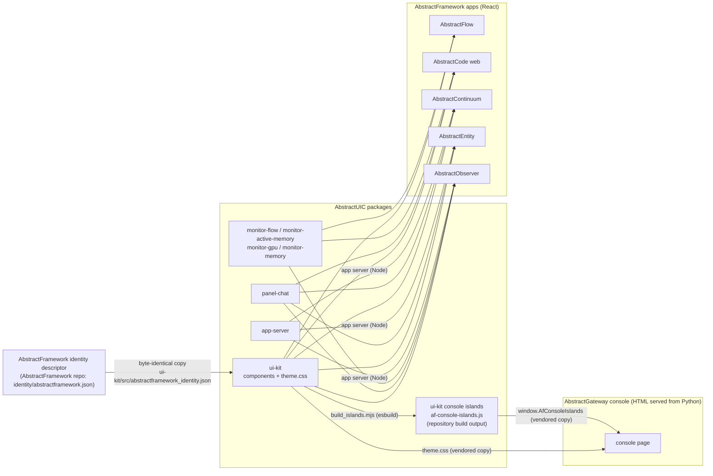
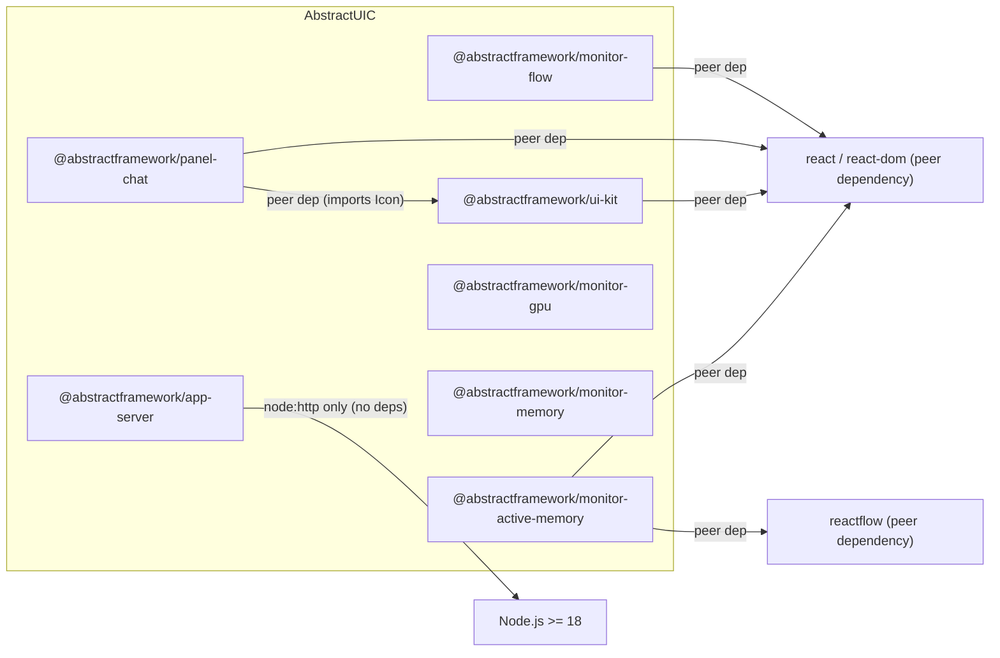
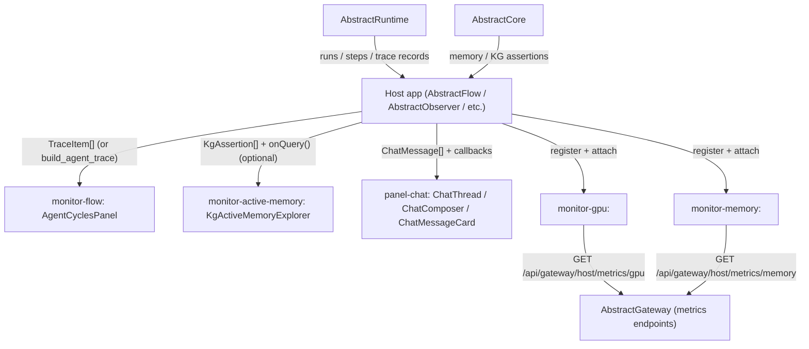
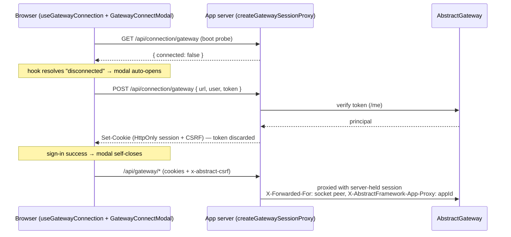
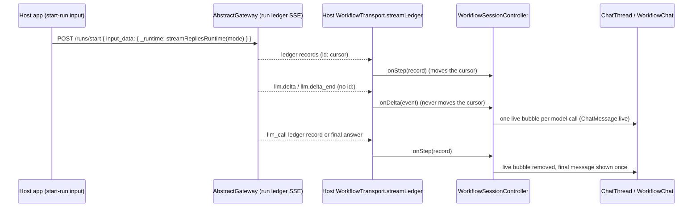
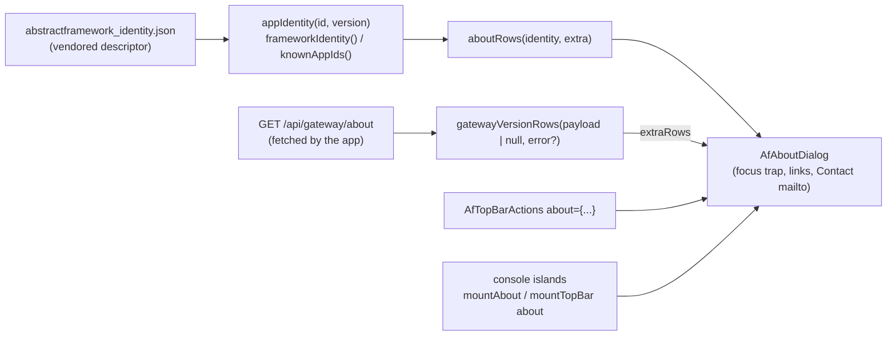
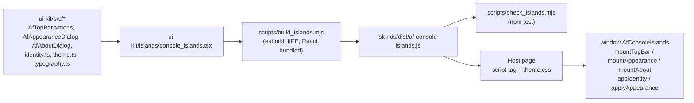

# Architecture

AbstractUIC is a **multi-package repository**: each folder at the repo root is an independently-consumable package.

Ecosystem context (external):
- AbstractFramework: https://github.com/lpalbou/AbstractFramework
- AbstractCore: https://github.com/lpalbou/abstractcore
- AbstractRuntime: https://github.com/lpalbou/abstractruntime

This document stays intentionally close to the code: package boundaries, exports, and contracts are backed by entrypoints/types in `src/` and by `exports` metadata in each `*/package.json`. References to the broader AbstractFramework ecosystem (AbstractCore / AbstractRuntime) are for context — AbstractUIC does not import those packages directly.

## High-level overview

- **React packages** ship **compiled ESM + type declarations** from `dist/` (see `exports` in each `package.json`). Source lives in `src/` and is built with `tsc`.
- **`@abstractframework/monitor-gpu`** and **`@abstractframework/monitor-memory`** ship **JavaScript** (`monitor-gpu/src`, `monitor-memory/src`) and register custom elements.
- **`@abstractframework/app-server`** ships Node.js JavaScript (`app-server/src`) with no runtime dependencies.
- Styling is shipped as plain CSS and exposed as package exports (e.g. `@abstractframework/panel-chat/panel_chat.css`).
- **Console islands** are a repository build output of `ui-kit` (`ui-kit/islands/`), not an npm export: one self-contained script for pages that are not React apps. See [Console islands](./console-islands.md).

## Packages and their consumers

The AbstractFramework apps consume the packages from npm (or as workspace links). The
AbstractGateway console is served from Python without an npm build, so it vendors generated
copies of the kit instead: the theme stylesheet and the console islands bundle.

```mermaid
flowchart LR
  subgraph UIC["AbstractUIC packages"]
    UIKIT["ui-kit<br/>components + theme.css"]
    ISL["ui-kit console islands<br/>af-console-islands.js<br/>(repository build output)"]
    CHAT["panel-chat"]
    APPSRV["app-server"]
    MON["monitor-flow / monitor-active-memory<br/>monitor-gpu / monitor-memory"]
  end

  UIKIT -->|"build_islands.mjs (esbuild)"| ISL

  subgraph Apps["AbstractFramework apps (React)"]
    FLOWAPP["AbstractFlow"]
    CODE["AbstractCode web"]
    CONT["AbstractContinuum"]
    ENT["AbstractEntity"]
    OBS["AbstractObserver"]
  end

  subgraph GW["AbstractGateway console (HTML served from Python)"]
    CONSOLE["console page"]
  end

  IDDESC["AbstractFramework identity descriptor<br/>(AbstractFramework repo: identity/abstractframework.json)"]
  IDDESC -->|"byte-identical copy<br/>ui-kit/src/abstractframework_identity.json"| UIKIT

  UIKIT --> FLOWAPP & CODE & CONT & ENT & OBS
  CHAT --> CODE & CONT & ENT & OBS
  MON --> FLOWAPP & CODE & OBS
  APPSRV -->|"app server (Node)"| CONT & ENT & OBS
  UIKIT -->|"theme.css (vendored copy)"| CONSOLE
  ISL -->|"window.AfConsoleIslands (vendored copy)"| CONSOLE
```

Every app renders its About dialog from the kit (`AfTopBarActions` `about` prop, or
`mountAbout` / the `about` prop of `mountTopBar` in the console). Monitor usage per app: AbstractFlow uses all four monitors; AbstractCode web uses
`monitor-flow` and `monitor-gpu`; AbstractObserver uses `monitor-flow`, `monitor-active-memory`
and `monitor-gpu`.

## Package dependency graph

```mermaid
flowchart LR
  subgraph AbstractUIC
    UIKIT["@abstractframework/ui-kit"]
    CHAT["@abstractframework/panel-chat"]
    APPSRV["@abstractframework/app-server"]
    FLOW["@abstractframework/monitor-flow"]
    AMX["@abstractframework/monitor-active-memory"]
    GPU["@abstractframework/monitor-gpu"]
    MEM["@abstractframework/monitor-memory"]
  end

  CHAT -->|"peer dep (imports Icon)"| UIKIT
  AMX -->|"peer dep"| ReactFlow["reactflow (peer dependency)"]
  FLOW -->|"peer dep"| React["react / react-dom (peer dependency)"]
  CHAT -->|"peer dep"| React
  UIKIT -->|"peer dep"| React
  AMX -->|"peer dep"| React
  APPSRV -->|"node:http only (no deps)"| Node["Node.js >= 18"]
```

Evidence:
- `panel-chat/src/chat_message_card.tsx` imports `Icon` from `@abstractframework/ui-kit`, declared as a peer dependency in `panel-chat/package.json`.
- `monitor-active-memory/package.json` declares `reactflow` (and `react` / `react-dom`) as peer dependencies.

## Runtime data flow

AbstractUIC components are designed to be **host-driven**: hosts provide data and callbacks; the packages do not import host code.

```mermaid
flowchart TD
  Runtime["AbstractRuntime"]
  Core["AbstractCore"]
  Host["Host app (AbstractFlow / AbstractObserver / etc.)"]

  Runtime -->|"runs / steps / trace records"| Host
  Core -->|"memory / KG assertions"| Host

  Host -->|"TraceItem[] (or build_agent_trace)"| FlowPanel["monitor-flow: AgentCyclesPanel"]
  Host -->|"KgAssertion[] + onQuery() (optional)"| AMXPanel["monitor-active-memory: KgActiveMemoryExplorer"]
  Host -->|"ChatMessage[] + callbacks"| ChatUI["panel-chat: ChatThread / ChatComposer / ChatMessageCard"]

  Host -->|"register + attach <monitor-gpu>"| GPUWidget["monitor-gpu: <monitor-gpu>"]
  GPUWidget -->|"GET /api/gateway/host/metrics/gpu"| Metrics["AbstractGateway (metrics endpoints)"]

  Host -->|"register + attach <monitor-memory>"| MemWidget["monitor-memory: <monitor-memory>"]
  MemWidget -->|"GET /api/gateway/host/metrics/memory"| Metrics
```

Evidence:
- `monitor-flow/src/AgentCyclesPanel.tsx` consumes `TraceItem[]` and groups cycles by `step.effect.type === "llm_call"`.
- `monitor-flow/src/agent_cycles_adapter.ts` exports `build_agent_trace(...)` to adapt ledger-like records into `TraceItem[]`.
- `monitor-active-memory/src/KgActiveMemoryExplorer.tsx` consumes `items: KgAssertion[]` and optionally calls `onQuery(params)`.
- `monitor-gpu/src/gpu_metrics_api.js` and `monitor-memory/src/memory_metrics_api.js` build/fetch the metrics URLs and attach Bearer auth headers.
- No direct dependency on AbstractCore/AbstractRuntime: see the absence of such dependencies in `*/package.json`.

## Contracts & types (what you pass in)

### Knowledge graph / active memory (`monitor-active-memory`)

- `KgAssertion` / `KgQueryParams` / `KgQueryResult`: `monitor-active-memory/src/types.ts`
- Graph utilities: `monitor-active-memory/src/graph.ts`
- Main component + callback contracts: `monitor-active-memory/src/KgActiveMemoryExplorer.tsx`

### Agent traces (`monitor-flow`)

- `TraceItem` / `TraceStep`: `monitor-flow/src/AgentCyclesPanel.tsx`
- Ledger adapter: `monitor-flow/src/agent_cycles_adapter.ts`

### Chat (`panel-chat`)

- `ChatMessage`, `ChatAttachment`, `ChatStat`, `ChatLiveReply`: `panel-chat/src/chat_message_card.tsx`
- `ChatThread` / `ChatComposer`: `panel-chat/src/chat_thread.tsx`, `panel-chat/src/chat_composer.tsx`
- `WorkflowTransport` / `WorkflowSessionController`: `panel-chat/src/workflow_runtime.ts`
- Live-reply events (`LlmDelta`, `LlmDeltaEnd`) and `streamRepliesRuntime`: `panel-chat/src/llm_delta.ts`

### GPU metrics (`monitor-gpu`)

The widget expects JSON that can be interpreted by `extractUtilizationGpuPct(payload)`:

- `payload.utilization_gpu_pct` (number) **or**
- `payload.gpus[][].utilization_gpu_pct` (numbers; averaged)

See: `monitor-gpu/src/gpu_metrics_api.js` and `monitor-gpu/src/monitor_gpu_widget.js`.

### Host memory metrics (`monitor-memory`)

The widget expects JSON that can be interpreted by `extractMemoryUsage(payload)` — the memory object directly or nested under `memory`:

- `ram.percent`, or `ram.used_bytes` / `ram.total_bytes` (used derivable from `total_bytes - available_bytes`)
- `device.backend` + `device.allocated_bytes` / `device.total_bytes` (allocated derivable from `total_bytes - free_bytes`)

A `404` or `supported: false` reply marks the endpoint unsupported and stops polling.

See: `monitor-memory/src/memory_metrics_api.js` and `monitor-memory/src/monitor_memory_widget.js`.

## Gateway connection flow (`app-server` + `ui-kit`)

Apps that talk to an AbstractGateway use the shared two-part connection surface: the
`app-server` session proxy on the app's own origin, and the `ui-kit` modal + hook in the
browser. The browser never holds the Gateway token.

```mermaid
sequenceDiagram
  participant B as Browser (useGatewayConnection + GatewayConnectModal)
  participant A as App server (createGatewaySessionProxy)
  participant G as AbstractGateway

  B->>A: GET /api/connection/gateway (boot probe)
  A-->>B: { connected: false }
  Note over B: hook resolves "disconnected" → modal auto-opens
  B->>A: POST /api/connection/gateway { url, user, token }
  A->>G: verify token (/me)
  G-->>A: principal
  A-->>B: Set-Cookie (HttpOnly session + CSRF) — token discarded
  Note over B: sign-in success → modal self-closes
  B->>A: /api/gateway/* (cookies + x-abstract-csrf)
  A->>G: proxied with server-held session<br/>X-Forwarded-For: socket peer, X-AbstractFramework-App-Proxy: appId
```

- Every request the proxy sends to the Gateway (the status probe, sign-in, sign-out and proxied
  `/api/*` calls) carries `X-Forwarded-For` set to the browser connection's socket address and
  `X-AbstractFramework-App-Proxy: <appId>`. Client-supplied forwarding headers and markers are
  replaced or dropped, never passed through, so the Gateway can tell whether the browser runs on
  its own machine. A connection whose socket address is unknown is refused with `400`.

- Contract details (auto-open rules, blocking vs dismissable, probe-once): see the
  [Adoption guide](./adoption-guide.md) and `ui-kit/README.md`.
- Evidence: `app-server/src/gateway_session_proxy.js`, `ui-kit/src/use_gateway_connection.ts`,
  `ui-kit/src/gateway_connect_modal.tsx`.

## Live replies (`panel-chat`)

When a run streams its model replies, the Gateway adds `llm.delta` and `llm.delta_end` events to
the run's ledger stream. The host transport hands them to `WorkflowSessionController`, which
shows one growing assistant bubble per model call until the durable ledger record replaces it.

```mermaid
sequenceDiagram
  participant H as Host app (start-run input)
  participant G as AbstractGateway (run ledger SSE)
  participant T as Host WorkflowTransport.streamLedger
  participant C as WorkflowSessionController
  participant V as ChatThread / WorkflowChat

  H->>G: POST /runs/start { input_data: { _runtime: streamRepliesRuntime(mode) } }
  G-->>T: ledger records (id: cursor)
  T->>C: onStep(record) (moves the cursor)
  G-->>T: llm.delta / llm.delta_end (no id:)
  T->>C: onDelta(event) (never moves the cursor)
  C->>V: one live bubble per model call (ChatMessage.live)
  G-->>T: llm_call ledger record or final answer
  T->>C: onStep(record)
  C->>V: live bubble removed, final message shown once
```

- `streamReplies` on `WorkflowChat` holds the host's "Stream replies" choice; the host maps it
  to `_runtime.stream` with `streamRepliesRuntime(mode)` (`"gateway_default"` leaves the key
  unset so the Gateway setting decides).
- A transport that does not pass `onDelta` keeps working: each reply appears when it is
  complete.
- Rules for bubbles (reconnect, sub-runs, failed or unavailable calls, render interval): see
  [`panel-chat/README.md`](../panel-chat/README.md#live-replies-streaming).

## About dialog and identity (`ui-kit`)

Every AbstractFramework app shows the same About facts. They come from one descriptor that the
kit ships as `ui-kit/src/abstractframework_identity.json`, a byte-identical copy of the
AbstractFramework repository's `identity/abstractframework.json`. The kit never fetches: the app
fetches the connected Gateway's versions and formats them with `gatewayVersionRows`.

```mermaid
flowchart LR
  DESC["abstractframework_identity.json<br/>(vendored descriptor)"]
  ID["appIdentity(id, version)<br/>frameworkIdentity() / knownAppIds()"]
  ROWS["aboutRows(identity, extra)"]
  GWROWS["gatewayVersionRows(payload | null, error?)"]
  ABOUTAPI["GET /api/gateway/about<br/>(fetched by the app)"]
  DLG["AfAboutDialog<br/>(focus trap, links, Contact mailto)"]
  TOP["AfTopBarActions about={...}"]
  ISL["console islands<br/>mountAbout / mountTopBar about"]

  DESC --> ID --> ROWS --> DLG
  ABOUTAPI --> GWROWS -->|"extraRows"| DLG
  TOP --> DLG
  ISL --> DLG
```

- The rows match the Python twins in AbstractCore (`abstractcore.utils.identity.about_fields`
  and `gateway_version_rows`); the shared fixture
  `ui-kit/scripts/fixtures/gateway_version_rows.json` pins both sides.
- Details and examples: [`ui-kit/README.md`](../ui-kit/README.md#about-dialog-and-identity).

## Console islands (`ui-kit`)

The console islands expose the kit's `AfTopBarActions`, `AfAppearanceDialog` and
`AfAboutDialog` to a page that is not a React app, through a prop-driven global API.

```mermaid
flowchart LR
  SRC["ui-kit/src/*<br/>AfTopBarActions, AfAppearanceDialog, AfAboutDialog,<br/>identity.ts, theme.ts, typography.ts"]
  ENTRY["ui-kit/islands/console_islands.tsx"]
  BUILD["scripts/build_islands.mjs<br/>(esbuild, IIFE, React bundled)"]
  OUT["islands/dist/af-console-islands.js"]
  CHECK["scripts/check_islands.mjs<br/>(npm test)"]
  PAGE["Host page<br/>script tag + theme.css"]
  API["window.AfConsoleIslands<br/>mountTopBar / mountAppearance / mountAbout<br/>appIdentity / applyAppearance"]

  SRC --> ENTRY --> BUILD --> OUT
  OUT --> CHECK
  OUT --> PAGE --> API
```

- The host owns all state and calls `handle.update(props)` when it changes.
- `apiVersion` (`"1"`) versions the island API; `kitVersion` records the `ui-kit` version the
  bundle was built from.
- The bundle carries no CSS; the host also serves `theme.css`.

Details, API and examples: [Console islands](./console-islands.md).

## Styling & theming

- `@abstractframework/ui-kit` provides CSS variables + theme classes in `ui-kit/src/theme.css` (exported as `@abstractframework/ui-kit/theme.css`) — 21 themes; see [Theming](./theming.md) for the token vocabulary and adoption rules.
- Other packages use those variables where available, but include fallbacks (e.g. `var(--ui-border-1, rgba(...))`).
- Non-CSS consumers can use the generated `ui-kit/palette_seeds.json` (4-token reduction per theme).

See also: [Getting started](./getting-started.md) for integration + required CSS.

## Related docs

- Getting started: [Getting started](./getting-started.md)
- API reference: [API reference](./api.md)
- Console islands: [Console islands](./console-islands.md)
- Theming: [Theming](./theming.md)
- FAQ: [FAQ](./faq.md)
- Troubleshooting: [Troubleshooting](./troubleshooting.md)
- Docs index: [Docs index](./README.md)
- Development: [Development](./development.md)
- Package docs: see the table in the root [`README.md`](../README.md)
