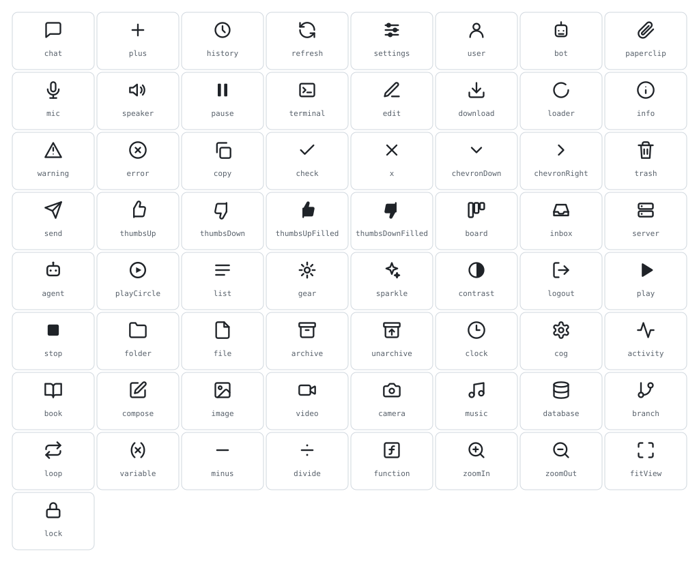
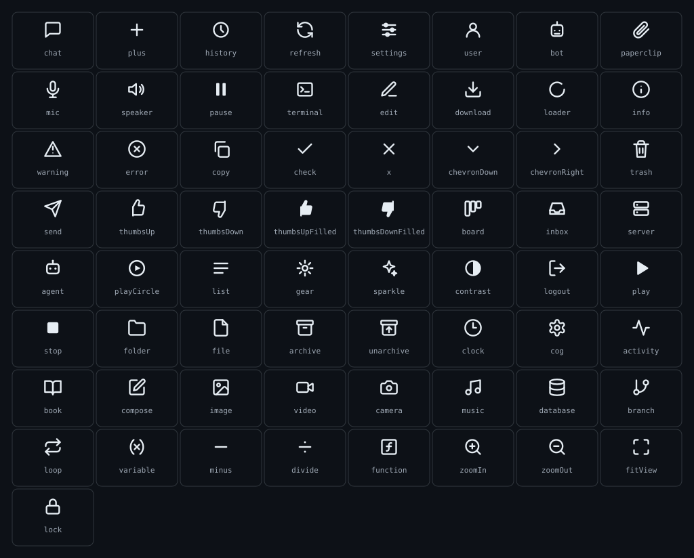

# Icons

`@abstractframework/ui-kit` ships one monochrome icon set for every AbstractFramework client: the
`Icon` component draws a named glyph in the current text colour (`currentColor`), so it follows
the active theme with no extra CSS.

```tsx
import { Icon, ICON_NAMES, type IconName } from "@abstractframework/ui-kit";

<Icon name="database" size={16} />          // decorative: aria-hidden
<Icon name="lock" size={16} title="Locked" /> // meaningful: role="img" with a <title>
```

- `name: IconName`: one of the names below. `size` (default 16) sets width and height in px.
  `title` makes the icon an image with an accessible name; without it the icon is hidden from
  assistive technology (put the name on the button instead, `aria-label`).
- `ICON_NAMES`: every name, in declaration order. Use it in a test to prove your own mapping only
  names icons that exist (AbstractFlow checks every node type this way).

## Contact sheet

Generated from the compiled package by `ui-kit/scripts/generate_icon_sheet.mjs`; the kit test
fails when a sheet is stale.





## Style

- **24-grid family** (most icons): `viewBox="0 0 24 24"`, stroke 2, round caps and joins, no
  fill. A solid part (a pupil, a dot, a filled twin) is a per-path `fill="currentColor"
  stroke="none"`.
- **16-grid family** (`board`, `inbox`, `server`, `agent`, `playCircle`, `list`, `gear`):
  `viewBox="0 0 16 16"`, stroke 1.4, kept verbatim from AbstractContinuum's navigation.
- Names are camelCase (`zoomOut`, `fitView`, `chevronDown`).

## Names

| Name | Grid | Typical use |
| --- | --- | --- |
| `chat` | 24 | Conversation, ask the user |
| `plus` | 24 | Add, new |
| `history` | 24 | Past runs, recall |
| `refresh` | 24 | Reload |
| `settings` | 24 | Settings (sliders) |
| `user` | 24 | Person, account |
| `bot` | 24 | Assistant |
| `paperclip` | 24 | Attach, artifact |
| `mic` | 24 | Record, transcribe |
| `speaker` | 24 | Read aloud, voice |
| `pause` | 24 | Pause (solid) |
| `terminal` | 24 | Command, code, tool call |
| `edit` | 24 | Edit |
| `download` | 24 | Download, import |
| `loader` | 24 | Busy (spin it with CSS) |
| `info` | 24 | Information |
| `warning` | 24 | Warning |
| `error` | 24 | Error |
| `copy` | 24 | Copy |
| `check` | 24 | Done, confirm |
| `x` | 24 | Close, remove |
| `chevronDown` | 24 | Expanded section |
| `chevronRight` | 24 | Collapsed section |
| `trash` | 24 | Delete |
| `send` | 24 | Send |
| `thumbsUp` | 24 | Vouch |
| `thumbsDown` | 24 | Flag |
| `thumbsUpFilled` | 24 | Vouch, pressed |
| `thumbsDownFilled` | 24 | Flag, pressed |
| `board` | 16 | Board, subflow |
| `inbox` | 16 | Inbox, incoming event |
| `server` | 16 | Server, provider |
| `agent` | 16 | Agent |
| `playCircle` | 16 | Start |
| `list` | 16 | List |
| `gear` | 16 | Settings (small) |
| `sparkle` | 24 | Generate, model call |
| `contrast` | 24 | Appearance |
| `logout` | 24 | Sign out |
| `play` | 24 | Run, active (solid) |
| `stop` | 24 | Stop, end (solid) |
| `folder` | 24 | Folder, workspace |
| `file` | 24 | File |
| `archive` | 24 | Archive |
| `unarchive` | 24 | Unarchive |
| `clock` | 24 | Time, schedule |
| `cog` | 24 | Settings (cog) |
| `activity` | 24 | Activity |
| `book` | 24 | Docs |
| `compose` | 24 | New conversation, write |
| `image` | 24 | Image (generate, edit, upscale) |
| `video` | 24 | Video |
| `camera` | 24 | Camera |
| `music` | 24 | Music |
| `database` | 24 | Stored memory, data store |
| `branch` | 24 | If / switch (one path in, several out) |
| `loop` | 24 | Loop, for, while |
| `variable` | 24 | Variable |
| `minus` | 24 | Subtract, zoom-out button without a magnifier |
| `divide` | 24 | Divide |
| `function` | 24 | Function, math operation |
| `zoomIn` | 24 | Zoom in |
| `zoomOut` | 24 | Zoom out |
| `fitView` | 24 | Fit everything in view |
| `lock` | 24 | Lock |

## Adding an icon

1. Add the name to the `IconName` union and to `ICON_NAMES` in `ui-kit/src/icon.tsx` (the build
   fails when a union name is missing from `ICON_NAMES`), and draw it in `paths()` on the 24-grid.
2. Add its row to the table above.
3. `npm run build -w @abstractframework/ui-kit && node ui-kit/scripts/generate_icon_sheet.mjs`
   to regenerate the contact sheets.
4. `npm test -w @abstractframework/ui-kit`: `check_icons.mjs` renders every name and compares
   the union, `ICON_NAMES` and this table.
